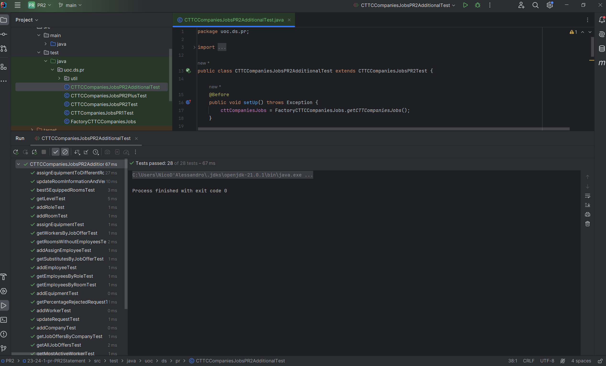

# UOC - Data Structures - PR2

## CTTCompaniesJobsImpl Implementation

This project is an implementation of the CTTCompaniesJobs interface, designed to manage job offers, workers, companies, and associated functionalities for a Technology and Telecommunications Center (CTT). It includes operations for handling workers, companies, job offers, enrollments, and more, with a focus on data structure and algorithm efficiency.

- Nicolás D'Alessandro
- January 2024

### 1. Introduction

This document explains the scope of the delivery, modifications, and/or updates for:

- Interface implementations:

  - `CTTCCompaniesJobsImpl`
  - `CTTCCompaniesJobsPR2Impl` 

- TDDs

  - `CTTCompaniesJobsPR1Test`
  - `CTTCCompaniesJobsPR2Test`
  - `CTTCCompaniesJobsPR2PlusTest`
  
This classes & TDD are aimed at managing and storing information related to workers, companies, job offers, roles, registrations and related entities.

### 2. Changes from CAA1 and PR1 

1. `CTTCompaniesJobsImpl`

   - **Introduction of New Data Structures**:

      - `DictionaryAVLImpl` for `workers` and `jobOffers` to replace previous data structures with AVL trees to improve search, insertion, and deletion efficiency.
      - `HashTable` for `companies`, optimizing for faster access and search capabilities.
      - `QueueLinkedList` for managing job requests, enabling efficient FIFO processing.
      - `OrderedVector` for `bestJobOffer` to manage the top-rated job offers, ensuring sorting in correct order and fast obtaining this data.

   - **Revised Methods**:
      - Modified `signUpJobOffer` to integrate the new logic of managing worker enrollments and substitute prioritization based on levels.
      - In `addWorker` and `addCompany` added a new logic to handle the addition or updating of `workers` and `companies` with the new data structures proposed.
      - Changes in `addRequest` and `updateRequest` to accommodate the new data structures and improved logic for handling job requests and their status updates.
      - Improved functionalities for adding and get job offer ratings, so the rankings managing in `bestJobOffer` are also improved.

   - **Exception Handling**:
     - Introducing specific exceptions to handle various scenarios, such as `WorkerNotFoundException`, `JobOfferNotFoundException`, and `WorkerAlreadyEnrolledException`.

2. Model Classes

   - **`Job Offer`**:

      - Changed to a `PriorityQueue` for managing substitutes with a self implemented comparator (`CMP_L`) to manage substitutes logic based on their `Level`.
      - The `Enrollment` instance is created with only the worker as a parameter
      - The `Request` attribute was removed to change in how job offers are linked to requests for a simplification of the relationship between these entities.
   
   - **`Worker`**:

      - New Attribute `level` of type `CTTCompaniesJobsPR2.Level` that represents the level of experience of the worker given (e.g., EXPERT, SENIOR, etc.).
      - The `addJobOffer` method updates the `workingDays` by adding the working days from each job offer.
      - Dynamic Level Adjustment also in the `addJobOffer` method that now includes logic to adjust the worker's level based on the total working hours calculated from the `workingDays`.
      - Methods `isInJobOffer` and `isInJobOfferAsSubstitute` have been refactored for better accuracy in determining if a worker is part of a specific job offer or as a substitute, utilizing an iterator for more efficient searching within the job offers and substitute linked lists.

   - **Other Model Classes**:
   
     - For the remaining classes it has been improved the code in terms of readability and structure, organizing classes by Constructor, Getters, Setters and Other Methods, making it easier to understand and maintain.

### 3. Implementation Highlights

3.1. **Data Structure Optimization:**

  - Optimal data structures were chosen for each entity, creating the new "Model" entities aimed at efficiently storage and balance between time complexity and spatial efficiency as we learnt in CAA1.
     - `DirectedGraph` for managing employee relationships.
     - `HashTable` for handling `Employee` and `Room` data.
     - `DictionaryAVLImpl` for managing `Equipment`.
     - `DSArray` for storing `Role` objects.
  - The Exception handling mechanisms requested where also implemented to provided correct error messages for each case.
  - Level consultation by providing the ability to query the level of a worker.
  - Job Offer and Enrollment that includes methods to retrieve workers and substitutes associated with specific job offers.
  - Social Network Features implemented based on the example given, with functionalities to manage followers and followings among employees, and to provide recommendations based on these relationships.

### 4. Testing and Validation

4.1. **Testing Approach:**

- The TDDs proposed were achieved with successful results, utilizing the proposed classes based on the given Factory.
- Those tests covered a wide range of scenarios, but we also include some new tests.

4.2. **Test Cases Proposed:**

  1. **`CTTCCompaniesJobsPR1Test`:**

     - `initialState()`
     - `addWorkerTest()`
     - `addCompanyTest()`
     - `addRequestTest()`
     - `updateRequestTest()`
     - `signUpJobOfferTest()`
     - `getPercentageRejectedRequestTest()`
     - `getJobOffersByCompanyTest()`
     - `getAllJobOffersTest()`
     - `getJobOffersByWorkerTest()`
     - `addRatingTest()`
     - `getRatingsByJobOfferTest()`
     - `getMostActiveWorkerTest()`
     - `getBestJobOfferTest()`

   2. **`CTTCCompaniesJobsPR2Test`:**

      - Inherits tests from `CTTCCompaniesJobsPR1Test`
      - `addRoleTest()`
      - `addEmployeeTest()`
      - `addRoomTest()`
      - `assignEmployeeTest()`
      - `getEmployeesByRoomTest()`
      - `getEmployeesByRoleTest()`
      - `addEquipmentTest()`
      - `assignEquipmentTest()`
      - `getLevelTest()`
      - `getWorkersByJobOfferTest()`
      - `getSubstitutesByJobOfferTest()`
      - `getRoomsWithoutEmployeesTest()`
      - `best5EquippedRoomsTest()`

   3. ****`CTTCCompaniesJobsPR2PlusTest`:****

      - Inherits tests from `CTTCCompaniesJobsPR2Test`
      - `addFollowerTest()`
      - `getFollowersTest()`
      - `getFollowingsTest()`
      - `recommendationTest()`
      - `getUnfollowedColleaguesTest()`

4.3. **New Test Cases added in `CTTCCompaniesJobsPR2AdditionalTest`**:

- Inherits tests from `CTTCCompaniesJobsPR2PlusTest`
- `assignEquipmentToDifferentRoomsTest()`: Verifies that equipment can be reassigned from one room to another and that it is correctly removed from the old room.
- `updateRoomInformationAndVerifyAssignmentsTest()`: Ensures that updating a room information does not affect the assignments of employees to that room.

### 5. Conclusion

We modified `CTTCCompaniesJobsImpl` and implemented `CTTCCompaniesJobsPR2Impl` classes with the goal of providing a robust and efficient system for managing the data in scenarios with large datasets. The transition to new non-linear structure where done to address some of the CAA1 defined structures, mainly because they are aligned more closely with the operational needs.
The TDD given on `CTTCCompaniesJobsPR1Test`, `CTTCCompaniesJobsPR2Test` and `CTTCCompaniesJobsPR2PlusTest` where passed successfully, and we also add some additional functionality tests.

### 6. Appendix

